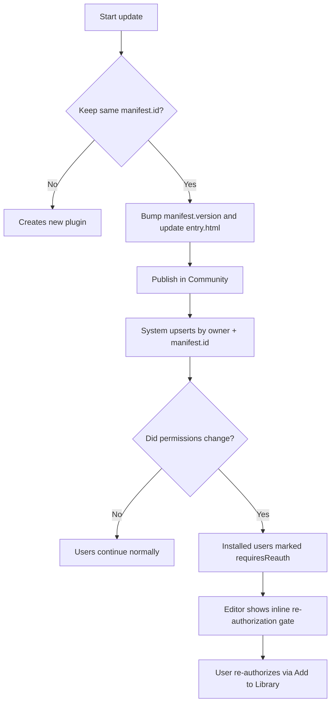

# FacetDeck Plugin SDK

Documentation-center edition generated from the in-product **Plugin Developer Center**.

## 1) Overview

FacetDeck plugins run in a frontend `iframe` sandbox and communicate with the host using `window.FacetDeck.api`.

- No direct backend runtime access
- No local disk scanning
- All sensitive actions are gated by declared capabilities and user authorization
- Distribution is via **Community plugin posts only**

## 2) Runtime Model

- **Execution**: sandboxed plugin iframe (`entry.html`)
- **Bridge**: `postMessage` + host SDK (`window.FacetDeck.api`)
- **UI**: your plugin controls its own HTML/CSS/JS
- **Editor placement**: installed plugins appear as right-panel tabs (same level as Copilot and Properties)

## 3) Starter Files

### `manifest.json`

```json
{
  "id": "my-first-plugin",
  "name": "My First Plugin",
  "version": "1.0.0",
  "description": "A simple plugin example.",
  "capabilities": [
    "context.pageHtml.read",
    "editor.slide.read"
  ]
}
```

### `entry.html`

```html
<!DOCTYPE html>
<html>
<head>
  <style>
    body { font-family: sans-serif; padding: 20px; color: #333; }
    button { padding: 8px 16px; background: #ff6b35; color: white; border: none; border-radius: 8px; cursor: pointer; }
  </style>
</head>
<body>
  <h3>Hello from Plugin!</h3>
  <button id="btn">Read Slide HTML</button>
  <pre id="out" style="background:#f4f4f4; padding:10px; border-radius:8px; margin-top:10px; max-height:200px; overflow:auto;"></pre>
  <script>
    document.getElementById("btn").addEventListener("click", async () => {
      try {
        const res = await window.FacetDeck.api.editor.getActiveSlideHtml();
        document.getElementById("out").textContent = String(res?.html || "").slice(0, 500) + "...";
      } catch (e) {
        document.getElementById("out").textContent = "Error: " + (e?.message || e);
      }
    });
  </script>
</body>
</html>
```

## 4) Quickstart (5 steps)

1. Create `manifest.json` and `entry.html`.
2. Declare only minimal capabilities.
3. Publish through a Community plugin post.
4. Add to Library, then enable in Profile if needed.
5. Open Editor and run your plugin tab.

## 5) Runnable Sample Project

Use the complete Vite sample:

`examples/facetdeck-plugin-vite-sample`

```text
facetdeck-plugin-vite-sample/
  package.json
  vite.config.js
  public/manifest.json
  src/main.js
  index.html
```

Run locally (this runs the **plugin project only**, not the whole FacetDeck SaaS):

```bash
cd examples/facetdeck-plugin-vite-sample
npm install
npm run dev
```

## 6) Publish Flow

1. Prepare `manifest.json` + `entry.html`
2. Open Community -> Plugins -> Publish
3. Upload files and publish as plugin post
4. Install via **Add to Library**
5. Enable in Profile (if disabled)
6. Open Editor and run

### Double-ID mode

- `manifest.id`: semantic, developer-defined
- `pluginUid`: system-generated, globally unique
- Same `manifest.id` can exist across different owners
- Update lineage is resolved by owner + `manifest.id`

## 7) Update Plugin

Use the same `manifest.id` and publish a new version.

If new capabilities are added, existing users are marked `requiresReauth` and must re-authorize.



### Permission change decision table

| Change type | User impact | Action required |
|---|---|---|
| Code/UI only (no permission change) | No reauth required | Publish new version and share changelog |
| Add optional capability | Feature may be gated until reauth | Prompt users to re-authorize |
| Add required capability | Marked `requiresReauth` | User must re-authorize before running |
| Remove capability | No extra user action | Publish and note reduced scope |
| Change `manifest.id` | Treated as new plugin | Only do this if intentionally creating a new plugin |

## 8) Capabilities

Declare capabilities in `manifest.json`.

```json
{
  "id": "my-plugin",
  "name": "My Plugin",
  "version": "1.0.0",
  "description": "Example",
  "capabilities": [
    "context.history.read",
    "context.pageHtml.read",
    "context.selection.read",
    "ai.chat.invoke",
    "ai.image.generate",
    "editor.slide.read",
    "editor.slide.write",
    "editor.resource.read",
    "editor.resource.write"
  ]
}
```

Use least-privilege by default.

## 9) Limits and Quota

- Managed AI calls consume user credits
- Resource uploads consume cloud storage quota
- API calls may be rate-limited
- Large payloads and long tasks may time out

## 10) Error Mapping

Use stable codes in plugin UI:

| Code | Match rule | User message |
|---|---|---|
| `AUTH_REQUIRED` | Unauthorized / Invalid token | Login expired. Please sign in again. |
| `PERMISSION_DENIED` | Capability not granted | This action needs extra permission. |
| `RATE_LIMITED` | rate limit / too many requests | Too many requests. Please retry later. |
| `CREDITS_EXHAUSTED` | credits / insufficient | Managed credits are exhausted. |
| `CLOUD_QUOTA_EXCEEDED` | cloud quota / capacity | Cloud storage quota reached. |
| `RESOURCE_TOO_LARGE` | too large | File is too large. |
| `INVALID_PAYLOAD` | invalid / missing | Request payload is invalid. |
| `REQUEST_TIMEOUT` | timeout | Request timed out. |
| `NETWORK_ERROR` | network/fetch errors | Network error. Check connection. |
| `UNKNOWN_ERROR` | fallback | Something went wrong. Please retry. |

## 11) Debugging

Checklist:

- Confirm plugin is installed and enabled
- Confirm required capabilities are declared
- Wrap all API calls in `try/catch`
- Inspect iframe + host console logs

Safe call helper:

```js
async function callWithToast(task) {
  try {
    return await task();
  } catch (err) {
    await window.FacetDeck.api.ui.toast({ message: String(err), type: "error" });
    throw err;
  }
}
```

Permission failure demo:

```js
try {
  await window.FacetDeck.api.editor.patchSlideHtml({ nextHtml: "<html>...</html>" });
} catch (err) {
  const msg = String(err || "");
  if (msg.toLowerCase().includes("capability") || msg.toLowerCase().includes("not granted")) {
    await window.FacetDeck.api.ui.toast({
      type: "error",
      message: "Missing permission. Re-install this plugin and grant editor.slide.write."
    });
  }
}
```

Recovery path: Community plugin post -> Add to Library (re-authorize) -> Profile -> Plugins (enabled).

## 12) API Reference (Full)

All methods are async under `window.FacetDeck.api`.

---

### Context

#### `context.getConversationHistory(options?)`
- Purpose: Read conversation history for reasoning context
- Capability: `context.history.read`
- Signature: `options?: { limit?: number; cursor?: number }`
- Returns: `{ ok: true; history: Message[]; nextCursor: number; hasMore: boolean }`
- Common errors: `PERMISSION_DENIED`, `REQUEST_TIMEOUT`
- Request:
```json
{
  "limit": 20,
  "cursor": 0
}
```
- Response:
```json
{
  "ok": true,
  "history": [
    { "role": "user", "content": "..." }
  ],
  "nextCursor": 20,
  "hasMore": true
}
```

#### `context.getCurrentPageHtml(options?)`
- Purpose: Read active page/slide HTML
- Capability: `context.pageHtml.read`
- Signature: `options?: { maxLength?: number }`
- Returns: `{ ok: true; html: string; slideId?: number; truncated: boolean }`
- Common errors: `PERMISSION_DENIED`, `INVALID_PAYLOAD`
- Request:
```json
{ "maxLength": 8000 }
```
- Response:
```json
{
  "ok": true,
  "html": "<!DOCTYPE html><html>...</html>",
  "slideId": 12,
  "truncated": false
}
```

#### `context.getSelection()`
- Purpose: Read selected tags/objects in editor context
- Capability: `context.selection.read`
- Signature: `()`
- Returns: `{ selection: Array<{ name: string; kind: string; slideId?: number }> }`
- Common errors: `PERMISSION_DENIED`
- Request:
```json
{}
```
- Response:
```json
{
  "selection": [
    { "name": "Title", "kind": "text", "slideId": 12 }
  ]
}
```

### AI

#### `ai.chat.completions.create(payload)`
- Purpose: Invoke chat completion via platform LLM gateway
- Capability: `ai.chat.invoke`
- Signature: `payload: { prompt: string; temperature?: number }`
- Returns: `{ text: string }`
- Common errors: `RATE_LIMITED`, `CREDITS_EXHAUSTED`, `REQUEST_TIMEOUT`
- Request:
```json
{
  "prompt": "Summarize this slide",
  "temperature": 0.2
}
```
- Response:
```json
{
  "text": "This slide introduces..."
}
```

#### `ai.image.generate(payload)`
- Purpose: Invoke text-to-image model
- Capability: `ai.image.generate`
- Signature: `payload: { prompt: string }`
- Returns: `{ imageUrl: string }`
- Common errors: `RATE_LIMITED`, `CREDITS_EXHAUSTED`, `REQUEST_TIMEOUT`
- Request:
```json
{
  "prompt": "A minimal orange abstract shape"
}
```
- Response:
```json
{
  "imageUrl": "data:image/png;base64,iVBORw0K..."
}
```

### Storage

#### `storage.get(key)`
- Purpose: Read plugin private key-value storage
- Capability: `none`
- Signature: `key: string`
- Returns: `{ value: string }`
- Common errors: `INVALID_PAYLOAD`
- Request:
```json
{ "key": "theme" }
```
- Response:
```json
{ "value": "dark" }
```

#### `storage.set(key, value)`
- Purpose: Write plugin private key-value storage
- Capability: `none`
- Signature: `key: string, value: string`
- Returns: `{ saved: true }`
- Common errors: `INVALID_PAYLOAD`
- Request:
```json
{
  "key": "theme",
  "value": "dark"
}
```
- Response:
```json
{ "saved": true }
```

### UI

#### `ui.toast(payload)`
- Purpose: Show host toast notification
- Capability: `none`
- Signature: `payload: { message: string; type?: 'info' | 'success' | 'error' | string }`
- Returns: `{ shown?: boolean } | void`
- Common errors: `INVALID_PAYLOAD`
- Request:
```json
{
  "message": "Done",
  "type": "success"
}
```
- Response:
```json
{ "shown": true }
```

#### `ui.openPanel(payload)`
- Purpose: Ask host to open a panel/tab
- Capability: `none`
- Signature: `payload: { id?: string }`
- Returns: `{ opened?: boolean } | void`
- Common errors: `INVALID_PAYLOAD`
- Request:
```json
{ "id": "plugins" }
```
- Response:
```json
{ "opened": true }
```

### Editor

#### `editor.getActiveSlideHtml()`
- Purpose: Read current active slide HTML
- Capability: `editor.slide.read`
- Signature: `()`
- Returns: `{ slideId?: number; html: string }`
- Common errors: `PERMISSION_DENIED`
- Request:
```json
{}
```
- Response:
```json
{
  "slideId": 12,
  "html": "<!DOCTYPE html><html>...</html>"
}
```

#### `editor.patchSlideHtml(payload)`
- Purpose: Replace target slide HTML in one call
- Capability: `editor.slide.write`
- Signature: `payload: { slideId?: number; nextHtml: string }`
- Returns: `{ patched: boolean }`
- Common errors: `PERMISSION_DENIED`, `INVALID_PAYLOAD`
- Request:
```json
{
  "slideId": 12,
  "nextHtml": "<!DOCTYPE html><html><body>...</body></html>"
}
```
- Response:
```json
{ "patched": true }
```

#### `editor.updateElementByDomPath(payload)`
- Purpose: Update one DOM element by CSS-like path
- Capability: `editor.slide.write`
- Signature: `payload: { slideId?: number; domPath: string; textPatch?: string; stylePatch?: { mode?: 'absolute' | 'offset'; x?: number; y?: number; w?: number; h?: number; css?: Record<string,string> } }`
- Returns: `{ updated: boolean }`
- Common errors: `PERMISSION_DENIED`, `INVALID_PAYLOAD`
- Request:
```json
{
  "slideId": 12,
  "domPath": "body > h1",
  "textPatch": "New title"
}
```
- Response:
```json
{ "updated": true }
```

#### `editor.beginTransaction()`
- Purpose: Start batched editor operation transaction
- Capability: `editor.slide.write`
- Signature: `()`
- Returns: `{ started: boolean }`
- Common errors: `PERMISSION_DENIED`
- Request:
```json
{}
```
- Response:
```json
{ "started": true }
```

#### `editor.commitTransaction()`
- Purpose: Commit current transaction
- Capability: `editor.slide.write`
- Signature: `()`
- Returns: `{ committed: boolean }`
- Common errors: `PERMISSION_DENIED`
- Request:
```json
{}
```
- Response:
```json
{ "committed": true }
```

#### `editor.rollbackTransaction()`
- Purpose: Roll back current transaction
- Capability: `editor.slide.write`
- Signature: `()`
- Returns: `{ rolledBack: boolean }`
- Common errors: `PERMISSION_DENIED`
- Request:
```json
{}
```
- Response:
```json
{ "rolledBack": true }
```

#### `editor.undo()`
- Purpose: Trigger host editor undo
- Capability: `editor.slide.write`
- Signature: `()`
- Returns: `{ undone: boolean }`
- Common errors: `PERMISSION_DENIED`
- Request:
```json
{}
```
- Response:
```json
{ "undone": true }
```

#### `editor.redo()`
- Purpose: Trigger host editor redo
- Capability: `editor.slide.write`
- Signature: `()`
- Returns: `{ redone: boolean }`
- Common errors: `PERMISSION_DENIED`
- Request:
```json
{}
```
- Response:
```json
{ "redone": true }
```

### Selector

#### `selector.enterPickMode()`
- Purpose: Enter visual pick mode in editor
- Capability: `editor.slide.read`
- Signature: `()`
- Returns: `{ active: boolean }`
- Common errors: `PERMISSION_DENIED`
- Request:
```json
{}
```
- Response:
```json
{ "active": true }
```

#### `selector.exitPickMode()`
- Purpose: Exit visual pick mode in editor
- Capability: `editor.slide.read`
- Signature: `()`
- Returns: `{ active: boolean }`
- Common errors: `PERMISSION_DENIED`
- Request:
```json
{}
```
- Response:
```json
{ "active": false }
```

#### `selector.getCurrentSelection()`
- Purpose: Read picked/selected element details
- Capability: `editor.slide.read`
- Signature: `()`
- Returns: `{ selection: SelectionTag[]; selectedPropertyElement?: object | null; isPickModeActive?: boolean }`
- Common errors: `PERMISSION_DENIED`
- Request:
```json
{}
```
- Response:
```json
{
  "selection": [
    { "name": "Title", "kind": "text", "slideId": 12 }
  ],
  "isPickModeActive": true
}
```

#### `selector.subscribeSelectionChange(handler)`
- Purpose: Subscribe to selection-change events
- Capability: `editor.slide.read`
- Signature: `(handler: (payload: unknown) => void)`
- Returns: `() => void // unsubscribe`
- Common errors: `PERMISSION_DENIED`
- Request:
```json
{
  "handler": "(payload) => { ... }"
}
```
- Response:
```json
{
  "unsubscribe": "function"
}
```

### Resources

#### `resources.list(payload?)`
- Purpose: List slide resources/elements
- Capability: `editor.resource.read`
- Signature: `payload?: { slideId?: number }`
- Returns: `{ elements: ResourceElement[] }`
- Common errors: `PERMISSION_DENIED`
- Request:
```json
{ "slideId": 12 }
```
- Response:
```json
{
  "elements": [
    {
      "id": "el_8d72",
      "name": "Hero image",
      "type": "IMAGE",
      "slideId": 12,
      "url": "https://oss.example.com/hero.png"
    }
  ]
}
```

#### `resources.createElement(payload)`
- Purpose: Create one resource/element record
- Capability: `editor.resource.write`
- Signature: `payload: { id?: string; name: string; type?: string; source?: 'slide' | 'asset'; slideId?: number; dataUrl?: string; url?: string; code?: string }`
- Returns: `{ element?: unknown }`
- Common errors: `PERMISSION_DENIED`, `INVALID_PAYLOAD`
- Request:
```json
{
  "name": "Logo",
  "type": "IMAGE",
  "slideId": 12,
  "dataUrl": "data:image/png;base64,iVBORw0K..."
}
```
- Response:
```json
{
  "element": {
    "id": "el_ab12",
    "name": "Logo",
    "type": "IMAGE",
    "slideId": 12
  }
}
```

#### `resources.updateElement(payload)`
- Purpose: Update one resource/element record
- Capability: `editor.resource.write`
- Signature: `payload: { id: string; patch: Partial<{ name: string; type: string; source: 'slide' | 'asset'; slideId: number; dataUrl: string; url: string; code: string }> }`
- Returns: `{ element?: unknown }`
- Common errors: `PERMISSION_DENIED`, `INVALID_PAYLOAD`
- Request:
```json
{
  "id": "el_ab12",
  "patch": {
    "name": "Logo v2"
  }
}
```
- Response:
```json
{
  "element": {
    "id": "el_ab12",
    "name": "Logo v2"
  }
}
```

#### `resources.deleteElement(payload)`
- Purpose: Delete one resource/element record
- Capability: `editor.resource.write`
- Signature: `payload: { id: string }`
- Returns: `{ deleted: boolean }`
- Common errors: `PERMISSION_DENIED`, `INVALID_PAYLOAD`
- Request:
```json
{ "id": "el_ab12" }
```
- Response:
```json
{ "deleted": true }
```

#### `resources.uploadDataUrl(payload)`
- Purpose: Upload data URL to managed storage and optionally create element
- Capability: `editor.resource.write`
- Signature: `payload: { dataUrl: string; fileName?: string; slideId?: number; createElement?: boolean; name?: string }`
- Returns: `{ upload: { url?: string }; element?: unknown | null }`
- Common errors: `PERMISSION_DENIED`, `RESOURCE_TOO_LARGE`, `CLOUD_QUOTA_EXCEEDED`
- Request:
```json
{
  "dataUrl": "data:image/png;base64,iVBORw0K...",
  "fileName": "gen-image.png",
  "slideId": 12,
  "createElement": true,
  "name": "AI image"
}
```
- Response:
```json
{
  "upload": { "url": "https://oss.example.com/uploads/gen-image.png" },
  "element": {
    "id": "el_ab12",
    "name": "AI image",
    "type": "IMAGE",
    "slideId": 12
  }
}
```

#### `resources.uploadRemoteUrl(payload)`
- Purpose: Fetch remote image, persist to managed storage, optionally create element
- Capability: `editor.resource.write`
- Signature: `payload: { url: string; fileName?: string; slideId?: number; createElement?: boolean; name?: string }`
- Returns: `{ upload: { url?: string }; element?: unknown | null }`
- Common errors: `PERMISSION_DENIED`, `NETWORK_ERROR`, `CLOUD_QUOTA_EXCEEDED`
- Request:
```json
{
  "url": "https://example.com/image.png",
  "slideId": 12,
  "createElement": true
}
```
- Response:
```json
{
  "upload": { "url": "https://oss.example.com/uploads/image.png" },
  "element": {
    "id": "el_bc34",
    "name": "Remote image",
    "type": "IMAGE"
  }
}
```

#### `resources.addImageToSlide(payload)`
- Purpose: Persist image + optional element + insert into slide HTML
- Capability: `editor.resource.write + editor.slide.write`
- Signature: `payload: { slideId?: number; name?: string; imageUrl?: string; dataUrl?: string; x?: number; y?: number; w?: number; h?: number; createElement?: boolean; persistRemoteUrl?: boolean }`
- Returns: `{ inserted: boolean; slideId?: number; imageUrl?: string; element?: unknown | null }`
- Common errors: `PERMISSION_DENIED`, `INVALID_PAYLOAD`, `CLOUD_QUOTA_EXCEEDED`
- Request:
```json
{
  "dataUrl": "data:image/png;base64,iVBORw0K...",
  "slideId": 12,
  "x": 120,
  "y": 120,
  "w": 280,
  "h": 180,
  "createElement": true
}
```
- Response:
```json
{
  "inserted": true,
  "slideId": 12,
  "imageUrl": "https://oss.example.com/uploads/img.png",
  "element": { "id": "el_cd34", "name": "Inserted image" }
}
```

### Events

#### `window.FacetDeck.on(eventName, handler)`
- Purpose: Subscribe to host-level SDK events
- Capability: `none`
- Signature: `(eventName: string, handler: (payload: unknown) => void)`
- Returns: `() => void // unsubscribe`
- Common errors: `UNKNOWN_ERROR`
- Request:
```json
{
  "eventName": "selector.selectionChanged",
  "handler": "(payload) => { ... }"
}
```
- Response:
```json
{
  "unsubscribe": "function"
}
```

## 13) FAQ

**Can plugins access backend runtime directly?**  
No. Plugins can only use exposed host APIs from sandbox.

**Can plugin UI be custom designed?**  
Yes. Plugin owns its `entry.html` UI and styles.

**How to update plugin releases?**  
Publish with same owner + `manifest.id`; system resolves update lineage.

**Can generated images be saved as slide resources?**  
Yes. Use `resources.uploadDataUrl` or `resources.addImageToSlide`.
