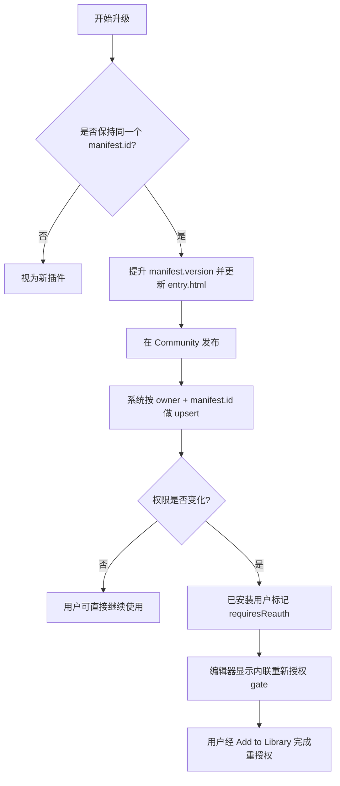

# FacetDeck 插件开发文档（中文）

本文档为文档中心版，内容与产品内 **Plugin Developer Center** 对齐，用于替换旧版快速入门文档。

## 1）概览

FacetDeck 插件运行在前端 `iframe` 沙箱中，通过 `window.FacetDeck.api` 调用宿主能力。

- 不可直接访问后端运行时
- 不可直接扫描本地磁盘
- 敏感能力必须在 `manifest` 声明并由用户授权
- 插件分发仅通过 **Community 插件帖**

## 2）运行模型

- **执行环境**：插件 `entry.html`（iframe sandbox）
- **通信方式**：`postMessage` + Host SDK
- **UI 控制权**：插件可自行设计 HTML/CSS/JS
- **编辑器挂载**：安装后作为右侧面板 tab（与 Copilot / Properties 同级）

## 3）起步文件

### `manifest.json`

```json
{
  "id": "my-first-plugin",
  "name": "My First Plugin",
  "version": "1.0.0",
  "description": "A simple plugin example.",
  "capabilities": [
    "context.pageHtml.read",
    "editor.slide.read"
  ]
}
```

### `entry.html`

```html
<!DOCTYPE html>
<html>
<head>
  <style>
    body { font-family: sans-serif; padding: 20px; color: #333; }
    button { padding: 8px 16px; background: #ff6b35; color: white; border: none; border-radius: 8px; cursor: pointer; }
  </style>
</head>
<body>
  <h3>Hello from Plugin!</h3>
  <button id="btn">Read Slide HTML</button>
  <pre id="out" style="background:#f4f4f4; padding:10px; border-radius:8px; margin-top:10px; max-height:200px; overflow:auto;"></pre>
  <script>
    document.getElementById("btn").addEventListener("click", async () => {
      try {
        const res = await window.FacetDeck.api.editor.getActiveSlideHtml();
        document.getElementById("out").textContent = String(res?.html || "").slice(0, 500) + "...";
      } catch (e) {
        document.getElementById("out").textContent = "Error: " + (e?.message || e);
      }
    });
  </script>
</body>
</html>
```

## 4）快速开始（5 步）

1. 创建 `manifest.json` 与 `entry.html`
2. 只声明最小必要权限
3. 在 Community 以插件帖发布
4. 通过 Add to Library 安装，并在 Profile 启用（如需要）
5. 打开编辑器，从插件 tab 运行

## 5）可运行示例工程

推荐使用完整 Vite 示例：

`examples/facetdeck-plugin-vite-sample`

```text
facetdeck-plugin-vite-sample/
  package.json
  vite.config.js
  public/manifest.json
  src/main.js
  index.html
```

本地运行命令（仅运行**插件工程**，不是运行整个 FacetDeck SaaS）：

```bash
cd examples/facetdeck-plugin-vite-sample
npm install
npm run dev
```

## 6）发布流程（Publish Flow）

1. 准备 `manifest.json` + `entry.html`
2. Community -> Plugins -> Publish
3. 上传文件并发布插件帖
4. 通过帖子 `Add to Library` 安装
5. 在 Profile 中启用（如被关闭）
6. 回到编辑器运行插件

### 双 ID 模式

- `manifest.id`：开发者语义 ID
- `pluginUid`：系统全局唯一 ID
- 不同作者可使用同名 `manifest.id`
- 升级链路按「作者 + manifest.id」归并

## 7）插件升级（Update Plugin）

保持 `manifest.id` 不变并发布新版本，即为升级。

若新增权限，已安装用户会被标记 `requiresReauth`，需要重新授权。



### 权限变更决策表

| 变更类型 | 对用户影响 | 需要动作 |
|---|---|---|
| 仅代码/UI 变更（无权限变更） | 无需重授权 | 发布新版本并写 changelog |
| 新增可选权限 | 功能可能被 gate | 引导用户按需重授权 |
| 新增必需权限 | 标记 `requiresReauth` | 用户必须重授权后才能运行 |
| 删除权限 | 无额外操作 | 发布并说明权限收敛 |
| 修改 `manifest.id` | 视为新插件 | 仅在确实要分叉新插件时使用 |

## 8）Capabilities（权限）

在 `manifest.json` 中声明：

```json
{
  "id": "my-plugin",
  "name": "My Plugin",
  "version": "1.0.0",
  "description": "Example",
  "capabilities": [
    "context.history.read",
    "context.pageHtml.read",
    "context.selection.read",
    "ai.chat.invoke",
    "ai.image.generate",
    "editor.slide.read",
    "editor.slide.write",
    "editor.resource.read",
    "editor.resource.write"
  ]
}
```

建议始终遵循最小权限原则。

## 9）额度与限制（Limits & Quota）

- 托管模型调用会消耗用户积分（credits）
- 资源上传会占用云存储额度
- API 调用会受限流策略影响
- 大 payload / 超时任务会失败，需要插件侧优雅重试

## 10）错误码映射（Error Mapping）

建议在插件 UI 内统一映射错误：

| Code | 匹配规则 | 用户提示 |
|---|---|---|
| `AUTH_REQUIRED` | Unauthorized / Invalid token | 登录已过期，请重新登录 |
| `PERMISSION_DENIED` | Capability not granted | 当前操作需要额外权限 |
| `RATE_LIMITED` | rate limit / too many requests | 请求过于频繁，请稍后重试 |
| `CREDITS_EXHAUSTED` | credits / insufficient | 托管模型积分不足 |
| `CLOUD_QUOTA_EXCEEDED` | cloud quota / capacity | 云存储额度已达上限 |
| `RESOURCE_TOO_LARGE` | too large | 文件体积过大 |
| `INVALID_PAYLOAD` | invalid / missing | 请求参数不合法 |
| `REQUEST_TIMEOUT` | timeout | 请求超时，请重试 |
| `NETWORK_ERROR` | network/fetch errors | 网络异常，请检查连接 |
| `UNKNOWN_ERROR` | fallback | 发生未知错误，请重试 |

## 11）调试（Debugging）

排查清单：

- 确认插件已安装且启用
- 确认能力声明完整
- 所有 API 调用都加 `try/catch`
- 对照 iframe 与宿主控制台日志

安全调用助手：

```js
async function callWithToast(task) {
  try {
    return await task();
  } catch (err) {
    await window.FacetDeck.api.ui.toast({ message: String(err), type: "error" });
    throw err;
  }
}
```

缺权限失败示例：

```js
try {
  await window.FacetDeck.api.editor.patchSlideHtml({ nextHtml: "<html>...</html>" });
} catch (err) {
  const msg = String(err || "");
  if (msg.toLowerCase().includes("capability") || msg.toLowerCase().includes("not granted")) {
    await window.FacetDeck.api.ui.toast({
      type: "error",
      message: "Missing permission. Re-install this plugin and grant editor.slide.write."
    });
  }
}
```

推荐恢复路径：Community 插件帖 -> Add to Library（重授权）-> Profile -> Plugins（确认启用）。

## 12）API 参考（完整）

以下 API 全部为异步方法，挂载于 `window.FacetDeck.api`。

---

### Context

#### `context.getConversationHistory(options?)`
- 作用：读取会话历史
- 权限：`context.history.read`
- 签名：`options?: { limit?: number; cursor?: number }`
- 返回：`{ ok: true; history: Message[]; nextCursor: number; hasMore: boolean }`
- 常见错误：`PERMISSION_DENIED`、`REQUEST_TIMEOUT`
- Request
```json
{
  "limit": 20,
  "cursor": 0
}
```
- Response
```json
{
  "ok": true,
  "history": [
    { "role": "user", "content": "..." }
  ],
  "nextCursor": 20,
  "hasMore": true
}
```

#### `context.getCurrentPageHtml(options?)`
- 作用：读取当前页面/幻灯片 HTML
- 权限：`context.pageHtml.read`
- 签名：`options?: { maxLength?: number }`
- 返回：`{ ok: true; html: string; slideId?: number; truncated: boolean }`
- 常见错误：`PERMISSION_DENIED`、`INVALID_PAYLOAD`
- Request
```json
{ "maxLength": 8000 }
```
- Response
```json
{
  "ok": true,
  "html": "<!DOCTYPE html><html>...</html>",
  "slideId": 12,
  "truncated": false
}
```

#### `context.getSelection()`
- 作用：读取当前选中对象
- 权限：`context.selection.read`
- 签名：`()`
- 返回：`{ selection: Array<{ name: string; kind: string; slideId?: number }> }`
- 常见错误：`PERMISSION_DENIED`
- Request
```json
{}
```
- Response
```json
{
  "selection": [
    { "name": "Title", "kind": "text", "slideId": 12 }
  ]
}
```

### AI

#### `ai.chat.completions.create(payload)`
- 作用：调用对话大模型
- 权限：`ai.chat.invoke`
- 签名：`payload: { prompt: string; temperature?: number }`
- 返回：`{ text: string }`
- 常见错误：`RATE_LIMITED`、`CREDITS_EXHAUSTED`、`REQUEST_TIMEOUT`
- Request
```json
{
  "prompt": "Summarize this slide",
  "temperature": 0.2
}
```
- Response
```json
{
  "text": "This slide introduces..."
}
```

#### `ai.image.generate(payload)`
- 作用：调用文生图模型
- 权限：`ai.image.generate`
- 签名：`payload: { prompt: string }`
- 返回：`{ imageUrl: string }`
- 常见错误：`RATE_LIMITED`、`CREDITS_EXHAUSTED`、`REQUEST_TIMEOUT`
- Request
```json
{
  "prompt": "A minimal orange abstract shape"
}
```
- Response
```json
{
  "imageUrl": "data:image/png;base64,iVBORw0K..."
}
```

### Storage

#### `storage.get(key)`
- 作用：读取插件私有 KV
- 权限：`none`
- 签名：`key: string`
- 返回：`{ value: string }`
- 常见错误：`INVALID_PAYLOAD`
- Request
```json
{ "key": "theme" }
```
- Response
```json
{ "value": "dark" }
```

#### `storage.set(key, value)`
- 作用：写入插件私有 KV
- 权限：`none`
- 签名：`key: string, value: string`
- 返回：`{ saved: true }`
- 常见错误：`INVALID_PAYLOAD`
- Request
```json
{
  "key": "theme",
  "value": "dark"
}
```
- Response
```json
{ "saved": true }
```

### UI

#### `ui.toast(payload)`
- 作用：显示宿主 toast
- 权限：`none`
- 签名：`payload: { message: string; type?: 'info' | 'success' | 'error' | string }`
- 返回：`{ shown?: boolean } | void`
- 常见错误：`INVALID_PAYLOAD`
- Request
```json
{
  "message": "Done",
  "type": "success"
}
```
- Response
```json
{ "shown": true }
```

#### `ui.openPanel(payload)`
- 作用：请求宿主打开面板
- 权限：`none`
- 签名：`payload: { id?: string }`
- 返回：`{ opened?: boolean } | void`
- 常见错误：`INVALID_PAYLOAD`
- Request
```json
{ "id": "plugins" }
```
- Response
```json
{ "opened": true }
```

### Editor

#### `editor.getActiveSlideHtml()`
- 作用：读取当前幻灯片 HTML
- 权限：`editor.slide.read`
- 签名：`()`
- 返回：`{ slideId?: number; html: string }`
- 常见错误：`PERMISSION_DENIED`
- Request
```json
{}
```
- Response
```json
{
  "slideId": 12,
  "html": "<!DOCTYPE html><html>...</html>"
}
```

#### `editor.patchSlideHtml(payload)`
- 作用：整页替换目标 slide HTML
- 权限：`editor.slide.write`
- 签名：`payload: { slideId?: number; nextHtml: string }`
- 返回：`{ patched: boolean }`
- 常见错误：`PERMISSION_DENIED`、`INVALID_PAYLOAD`
- Request
```json
{
  "slideId": 12,
  "nextHtml": "<!DOCTYPE html><html><body>...</body></html>"
}
```
- Response
```json
{ "patched": true }
```

#### `editor.updateElementByDomPath(payload)`
- 作用：按 DOM 路径更新单元素
- 权限：`editor.slide.write`
- 签名：`payload: { slideId?: number; domPath: string; textPatch?: string; stylePatch?: { mode?: 'absolute' | 'offset'; x?: number; y?: number; w?: number; h?: number; css?: Record<string,string> } }`
- 返回：`{ updated: boolean }`
- 常见错误：`PERMISSION_DENIED`、`INVALID_PAYLOAD`
- Request
```json
{
  "slideId": 12,
  "domPath": "body > h1",
  "textPatch": "New title"
}
```
- Response
```json
{ "updated": true }
```

#### `editor.beginTransaction()`
- 作用：开始事务
- 权限：`editor.slide.write`
- 签名：`()`
- 返回：`{ started: boolean }`
- 常见错误：`PERMISSION_DENIED`
- Request
```json
{}
```
- Response
```json
{ "started": true }
```

#### `editor.commitTransaction()`
- 作用：提交事务
- 权限：`editor.slide.write`
- 签名：`()`
- 返回：`{ committed: boolean }`
- 常见错误：`PERMISSION_DENIED`
- Request
```json
{}
```
- Response
```json
{ "committed": true }
```

#### `editor.rollbackTransaction()`
- 作用：回滚事务
- 权限：`editor.slide.write`
- 签名：`()`
- 返回：`{ rolledBack: boolean }`
- 常见错误：`PERMISSION_DENIED`
- Request
```json
{}
```
- Response
```json
{ "rolledBack": true }
```

#### `editor.undo()`
- 作用：触发撤销
- 权限：`editor.slide.write`
- 签名：`()`
- 返回：`{ undone: boolean }`
- 常见错误：`PERMISSION_DENIED`
- Request
```json
{}
```
- Response
```json
{ "undone": true }
```

#### `editor.redo()`
- 作用：触发重做
- 权限：`editor.slide.write`
- 签名：`()`
- 返回：`{ redone: boolean }`
- 常见错误：`PERMISSION_DENIED`
- Request
```json
{}
```
- Response
```json
{ "redone": true }
```

### Selector

#### `selector.enterPickMode()`
- 作用：进入可视化选取模式
- 权限：`editor.slide.read`
- 签名：`()`
- 返回：`{ active: boolean }`
- 常见错误：`PERMISSION_DENIED`
- Request
```json
{}
```
- Response
```json
{ "active": true }
```

#### `selector.exitPickMode()`
- 作用：退出可视化选取模式
- 权限：`editor.slide.read`
- 签名：`()`
- 返回：`{ active: boolean }`
- 常见错误：`PERMISSION_DENIED`
- Request
```json
{}
```
- Response
```json
{ "active": false }
```

#### `selector.getCurrentSelection()`
- 作用：读取当前选取状态
- 权限：`editor.slide.read`
- 签名：`()`
- 返回：`{ selection: SelectionTag[]; selectedPropertyElement?: object | null; isPickModeActive?: boolean }`
- 常见错误：`PERMISSION_DENIED`
- Request
```json
{}
```
- Response
```json
{
  "selection": [
    { "name": "Title", "kind": "text", "slideId": 12 }
  ],
  "isPickModeActive": true
}
```

#### `selector.subscribeSelectionChange(handler)`
- 作用：订阅选区变化事件
- 权限：`editor.slide.read`
- 签名：`(handler: (payload: unknown) => void)`
- 返回：`() => void // 取消订阅`
- 常见错误：`PERMISSION_DENIED`
- Request
```json
{
  "handler": "(payload) => { ... }"
}
```
- Response
```json
{
  "unsubscribe": "function"
}
```

### Resources

#### `resources.list(payload?)`
- 作用：列出资源/元素
- 权限：`editor.resource.read`
- 签名：`payload?: { slideId?: number }`
- 返回：`{ elements: ResourceElement[] }`
- 常见错误：`PERMISSION_DENIED`
- Request
```json
{ "slideId": 12 }
```
- Response
```json
{
  "elements": [
    {
      "id": "el_8d72",
      "name": "Hero image",
      "type": "IMAGE",
      "slideId": 12,
      "url": "https://oss.example.com/hero.png"
    }
  ]
}
```

#### `resources.createElement(payload)`
- 作用：创建元素记录
- 权限：`editor.resource.write`
- 签名：`payload: { id?: string; name: string; type?: string; source?: 'slide' | 'asset'; slideId?: number; dataUrl?: string; url?: string; code?: string }`
- 返回：`{ element?: unknown }`
- 常见错误：`PERMISSION_DENIED`、`INVALID_PAYLOAD`
- Request
```json
{
  "name": "Logo",
  "type": "IMAGE",
  "slideId": 12,
  "dataUrl": "data:image/png;base64,iVBORw0K..."
}
```
- Response
```json
{
  "element": {
    "id": "el_ab12",
    "name": "Logo",
    "type": "IMAGE",
    "slideId": 12
  }
}
```

#### `resources.updateElement(payload)`
- 作用：更新元素记录
- 权限：`editor.resource.write`
- 签名：`payload: { id: string; patch: Partial<{ name: string; type: string; source: 'slide' | 'asset'; slideId: number; dataUrl: string; url: string; code: string }> }`
- 返回：`{ element?: unknown }`
- 常见错误：`PERMISSION_DENIED`、`INVALID_PAYLOAD`
- Request
```json
{
  "id": "el_ab12",
  "patch": {
    "name": "Logo v2"
  }
}
```
- Response
```json
{
  "element": {
    "id": "el_ab12",
    "name": "Logo v2"
  }
}
```

#### `resources.deleteElement(payload)`
- 作用：删除元素记录
- 权限：`editor.resource.write`
- 签名：`payload: { id: string }`
- 返回：`{ deleted: boolean }`
- 常见错误：`PERMISSION_DENIED`、`INVALID_PAYLOAD`
- Request
```json
{ "id": "el_ab12" }
```
- Response
```json
{ "deleted": true }
```

#### `resources.uploadDataUrl(payload)`
- 作用：上传 dataUrl 到托管存储，并可选创建元素
- 权限：`editor.resource.write`
- 签名：`payload: { dataUrl: string; fileName?: string; slideId?: number; createElement?: boolean; name?: string }`
- 返回：`{ upload: { url?: string }; element?: unknown | null }`
- 常见错误：`PERMISSION_DENIED`、`RESOURCE_TOO_LARGE`、`CLOUD_QUOTA_EXCEEDED`
- Request
```json
{
  "dataUrl": "data:image/png;base64,iVBORw0K...",
  "fileName": "gen-image.png",
  "slideId": 12,
  "createElement": true,
  "name": "AI image"
}
```
- Response
```json
{
  "upload": { "url": "https://oss.example.com/uploads/gen-image.png" },
  "element": {
    "id": "el_ab12",
    "name": "AI image",
    "type": "IMAGE",
    "slideId": 12
  }
}
```

#### `resources.uploadRemoteUrl(payload)`
- 作用：抓取远端图片并持久化，可选创建元素
- 权限：`editor.resource.write`
- 签名：`payload: { url: string; fileName?: string; slideId?: number; createElement?: boolean; name?: string }`
- 返回：`{ upload: { url?: string }; element?: unknown | null }`
- 常见错误：`PERMISSION_DENIED`、`NETWORK_ERROR`、`CLOUD_QUOTA_EXCEEDED`
- Request
```json
{
  "url": "https://example.com/image.png",
  "slideId": 12,
  "createElement": true
}
```
- Response
```json
{
  "upload": { "url": "https://oss.example.com/uploads/image.png" },
  "element": {
    "id": "el_bc34",
    "name": "Remote image",
    "type": "IMAGE"
  }
}
```

#### `resources.addImageToSlide(payload)`
- 作用：上传/持久化图片并插入到 slide HTML（可选创建元素）
- 权限：`editor.resource.write + editor.slide.write`
- 签名：`payload: { slideId?: number; name?: string; imageUrl?: string; dataUrl?: string; x?: number; y?: number; w?: number; h?: number; createElement?: boolean; persistRemoteUrl?: boolean }`
- 返回：`{ inserted: boolean; slideId?: number; imageUrl?: string; element?: unknown | null }`
- 常见错误：`PERMISSION_DENIED`、`INVALID_PAYLOAD`、`CLOUD_QUOTA_EXCEEDED`
- Request
```json
{
  "dataUrl": "data:image/png;base64,iVBORw0K...",
  "slideId": 12,
  "x": 120,
  "y": 120,
  "w": 280,
  "h": 180,
  "createElement": true
}
```
- Response
```json
{
  "inserted": true,
  "slideId": 12,
  "imageUrl": "https://oss.example.com/uploads/img.png",
  "element": { "id": "el_cd34", "name": "Inserted image" }
}
```

### Events

#### `window.FacetDeck.on(eventName, handler)`
- 作用：订阅宿主级事件
- 权限：`none`
- 签名：`(eventName: string, handler: (payload: unknown) => void)`
- 返回：`() => void // 取消订阅`
- 常见错误：`UNKNOWN_ERROR`
- Request
```json
{
  "eventName": "selector.selectionChanged",
  "handler": "(payload) => { ... }"
}
```
- Response
```json
{
  "unsubscribe": "function"
}
```

## 13）FAQ

**Q：插件能直接访问后端运行时吗？**  
A：不能。只能通过宿主暴露 API 访问能力。

**Q：插件 UI 可以自定义吗？**  
A：可以。插件完全控制自身 `entry.html` 的 UI 与样式。

**Q：插件怎么升级？**  
A：保持同一作者 + `manifest.id`，发布新版本即可。

**Q：AI 生成图片可以保存为资源吗？**  
A：可以，用 `resources.uploadDataUrl` 或 `resources.addImageToSlide`。
# FacetDeck 插件 SDK 快速上手（中文）