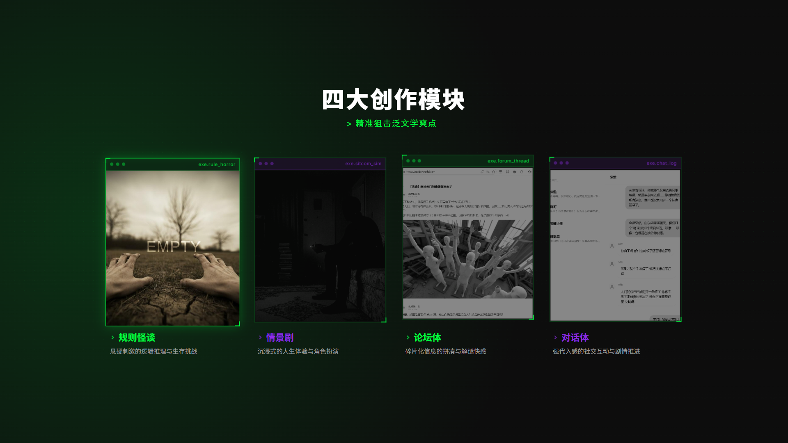
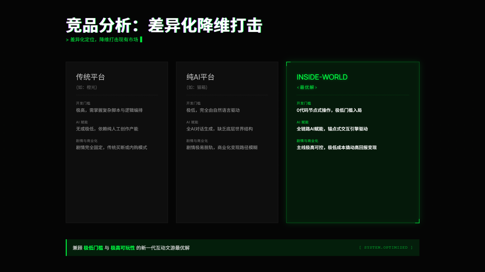
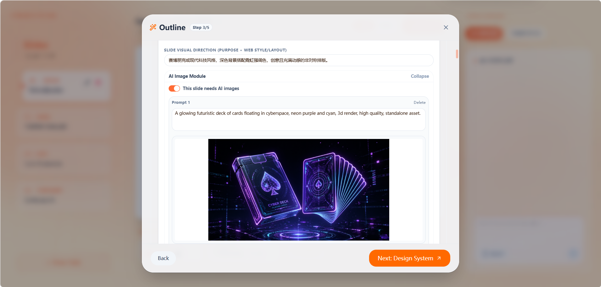
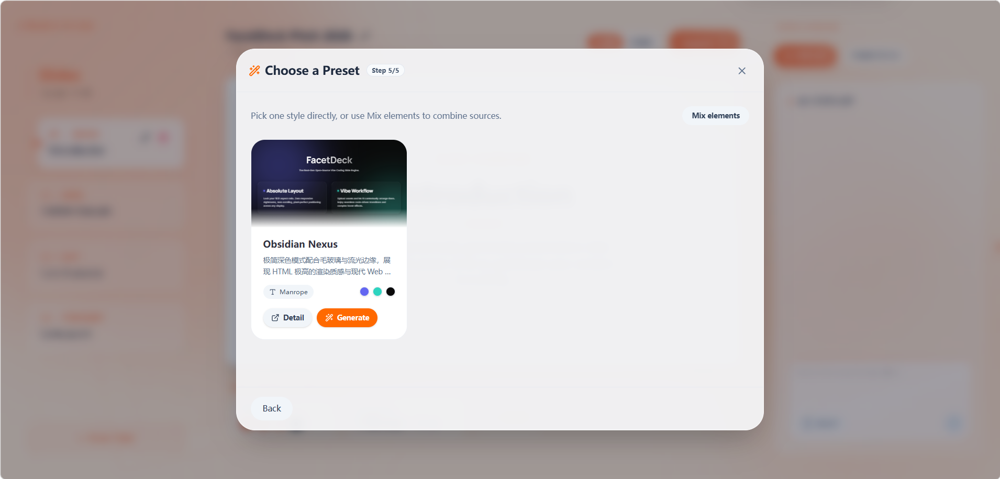
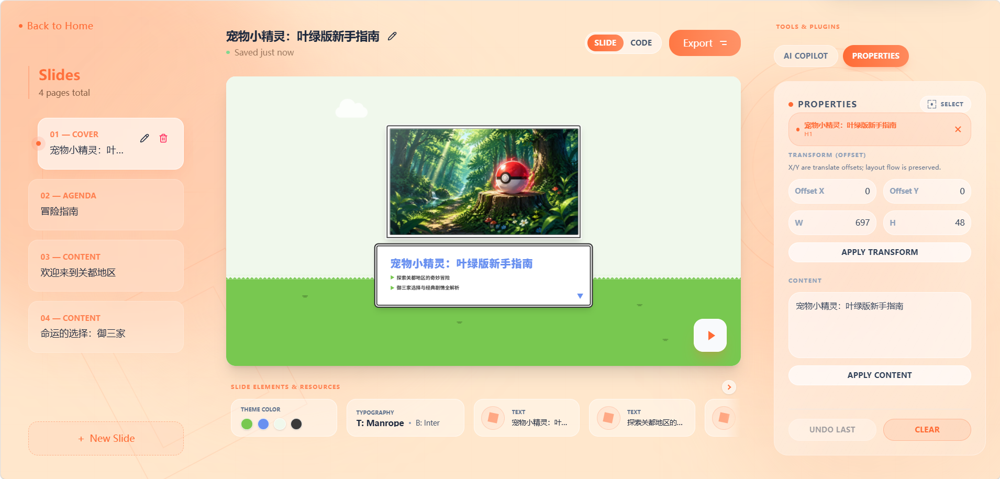
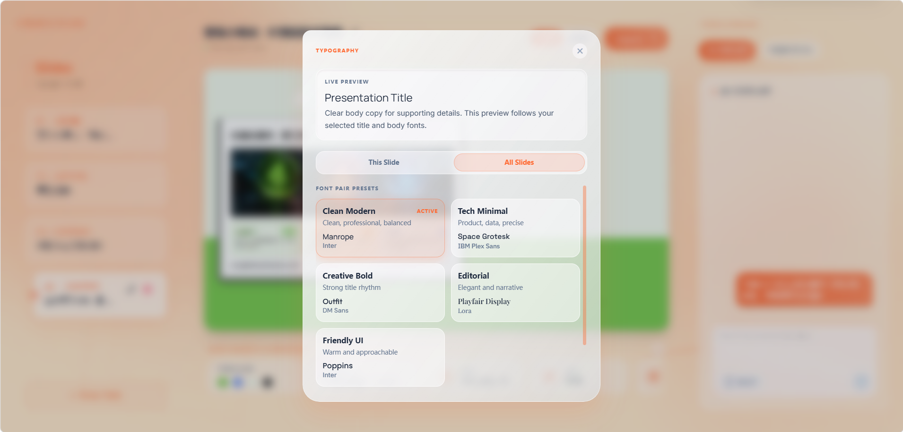
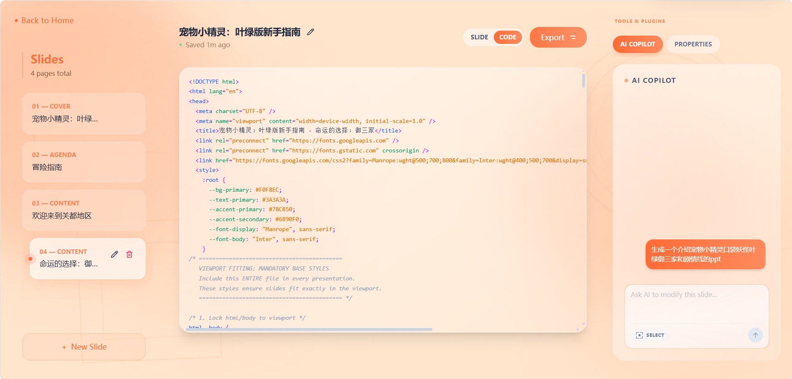

# FacetDeck

**Language / 语言**: [中文](#中文) | [English](#english)

[🌐 官网](https://facetdeck.com) · [🐙 GitHub](https://github.com/TownResearcher/facetdeck.git)

---

## 中文

# 别被“一锤子买卖”的 AI PPT 忽悠了。我们打造了下一代开源 Vibe Coding 幻灯片引擎：FacetDeck

> **如果现在让你用 AI 做一份下周的路演 PPT，你会经历什么？**
>
> 🤬 输入一句话，AI 给你套用了一个充满年代感的僵硬模板。  
> 🤬 页面上的配图是 AI 强行生成的“西装男握手”废话图。  
> 🤬 动画效果永远是千年不变的百叶窗。  
> 🤬 最崩溃的是：你想把第二页标题往左挪两厘米？对不起，不支持。你要么重新生成一次（俗称一锤子买卖），要么导出 PPTX 忍受排版错乱。

**老实说，让 AI 去生成复杂的 PPT 图形排版，本身就是个伪命题。**  
在 Vibe Coding（直觉编程）爆发的今天，大模型真正碾压人类的，是 **写前端代码** 的能力。

如果用 HTML 网页来做演示呢？  
你能获得 PPT 望尘莫及的 **悬停动效、丝滑跳转和极其复杂的页面过渡**。  
但现实很骨感：网页演示一旦更换显示器或拉伸浏览器，排版立刻错乱、溢出，甚至出现丑陋的滚动条；一旦断网，你的网页演示直接变成 Chrome 小恐龙。想精准调节某段文字、某个图片，AI 却大动干戈，要改的没改，不要改的全乱了套，每次都是在抽盲盒。

**直到今天。**

**FacetDeck** —— 基于 Vibe Coding 的开源 HTML 幻灯片生成器。我们不仅让 AI 用代码写出绝美的网页级演示，更彻底解决了“网页做演示”的所有痛点。

**真正的 Vibe 工作流，告别“瞎配图”**  
只用输入你的想法，进入我们独创的 **5 步 Setup 阶段**。这绝不是一个黑盒操作！  
在这个阶段，你可以上传自己的核心图片素材。神奇的是，系统在生成大纲时，会 **智能判断在哪一页使用你上传的哪张图片**。  
遇到需要配图但你没提供的地方？AI 会为你 **自动撰写精准的生图提示词（Prompt）**。一切都由你掌控，你可以随时增删页数、修改大纲。选定风格后，一键渲染出图。

**拒绝一锤子买卖，神级“三重微调”**  
生成完毕不满意？在 FacetDeck 强大的编辑器里，我们提供三种跨纬度的修改方案：

- **A. 对话微调（Vibe 模式）**：选中页面上的任何元素（或不选），直接和侧边栏 AI 说“把这个标题改成赛博朋克风并加粗”，瞬间完成。
- **B. 属性面板（UI 模式）**：像用 Figma 一样，直接修改文字、拖拽图片、精准调整装饰物的颜色和位置。底部“素材区”甚至支持一键修改全局主题色和字体。
- **C. 代码直修（Code 模式）**：提供代码编辑视图，直接修改底层 HTML，实时热更新渲染。

**终结响应式噩梦，死磕“绝对排版”**  
用网页做 PPT 最怕变形。FacetDeck 彻底锁死了 16:9 比例。  
无论你是在 4K 宽屏、MacBook 还是连接投影仪的旧电脑，甚至随意拖拽浏览器窗口，**页面元素相对位置绝对固定，绝不会出现任何元素超出边界，彻底消灭滚动条。** 你看到的是什么样，观众看到的就是什么样。

**断网也能秀？极致的离线体验与生态**  
马上要上台路演，现场没网怎么办？  
很多工具只能降级导出为死板的 PPTX 或 PDF。而 FacetDeck 支持 **一键下载为静态 HTML 网页**。  
即使拔掉网线，你依然可以在浏览器中完美播放那些包含复杂悬停、代码级过渡的极致动效（当然，我们也支持一键分享链接和 PDF 导出）。

不仅如此，FacetDeck 还是一个 **活的开源生态**：  
内置模板中心和插件市场。你可以一键 Copy 别人的绝美幻灯片模板，或者根据我们提供的 API，Coding 自己专属的组件插件并发布到市场。

**One More Thing：自带 Key？完全免费！**  
作为一款开源信仰产品，我们把选择权交给你。  
如果你配置自己大模型的 API Key，**FacetDeck 不会向你收取一分钱，完全免费！**  
如果你不想折腾，也没问题：新用户可获赠积分，邀请好友可再获奖励积分。

### 💌 来自开发者的信

Hi，我是 **Shaun**。  
FacetDeck 的诞生，是因为我受够了那些打着 AI 旗号、却连个字号都改不了的“PPT 生成器”。我相信，未来的演示应该是基于 Web 原生的、充满 Vibe 的、更是开放且可控的。

**FacetDeck 目前已经开源！** 所有编辑好的演示都会保存在你的专属仓库中。

- 👉 [点击访问官网](https://facetdeck.com)
- 🐙 [去 GitHub 点个 Star](https://github.com/TownResearcher/facetdeck.git)
- 📧 联系邮箱：`shaungladtoseeu@gmail.com`

*(💡 Special Thanks to **zarazhangrui** 及其开源 **frontend-slides** 项目，为 FacetDeck 提供了宝贵灵感与部分设计基石。)*

---

## English

## Stop using one-shot AI PPT generators.

**FacetDeck** is an open-source Vibe Coding HTML slide engine.

If you have ever generated an AI deck and got:

- rigid outdated templates,
- meaningless stock-like images,
- repetitive transitions,
- and no way to make precise edits without regenerating everything,

you already know the problem.

Instead of forcing LLMs to fake traditional PPT layout systems, FacetDeck lets models do what they are best at: **writing frontend code**.

### What makes FacetDeck different?

- A guided **5-step Setup workflow** (not a black box).
- Smart material-aware outline generation using your uploaded images.
- AI prompt generation for missing visuals.
- **Triple refinement modes** after generation:
  - Chat refinement (Vibe mode)
  - Visual property editing (UI mode)
  - Direct HTML editing (Code mode)
- Strict **16:9 presentation-safe rendering** across screens.
- **Offline-ready static HTML export** while preserving web-native motion.
- Open template/plugin ecosystem.

### Product visuals

### Quick start

1. `npm install`
2. Copy `.env.example` to `.env`
3. Set open-source mode:
   - `FACETDECK_DISTRIBUTION_MODE=oss`
   - `VITE_FACETDECK_MODE=oss`
4. Start full stack: `npm run dev:full`

More commands:

- API only: `npm run dev:api`
- Frontend only: `npm run dev`
- Production build: `npm run build`

### Links

- Website: [facetdeck.com](https://facetdeck.com)
- GitHub: [TownResearcher/facetdeck](https://github.com/TownResearcher/facetdeck.git)
- Email: `shaungladtoseeu@gmail.com`

[Back to top](#top)

---

## License

Licensed under `AGPL-3.0-or-later`. See `LICENSE`.